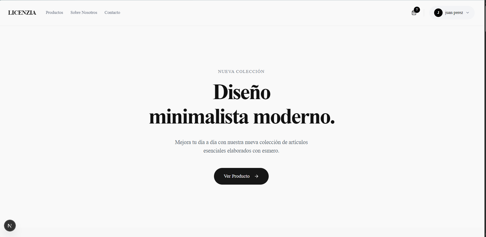
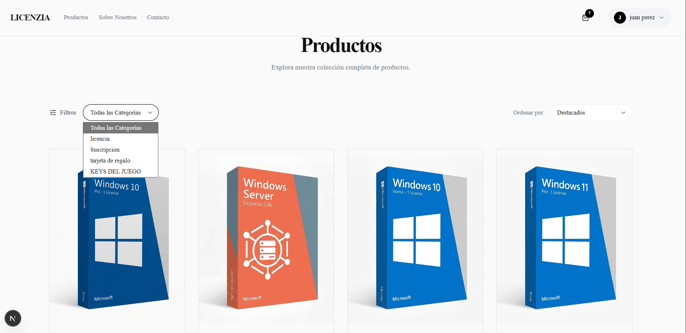
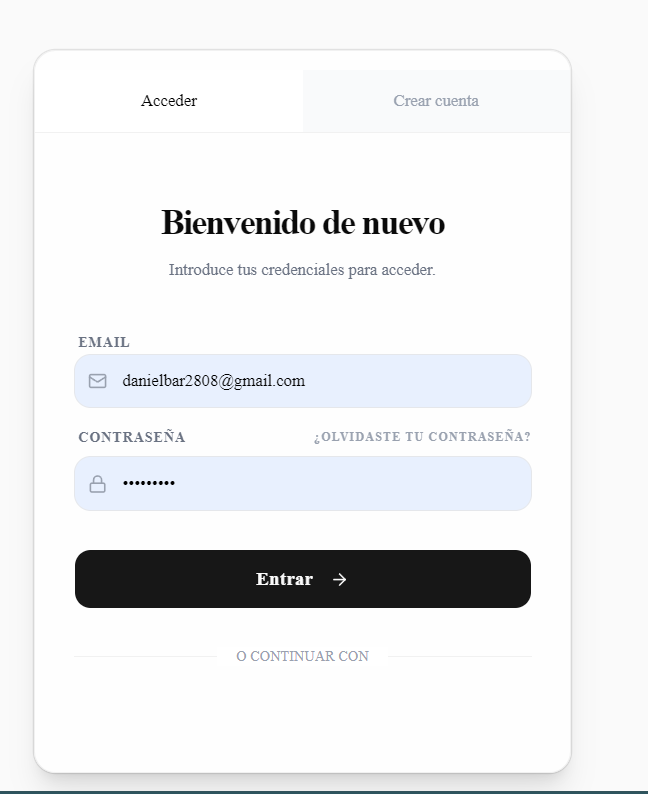
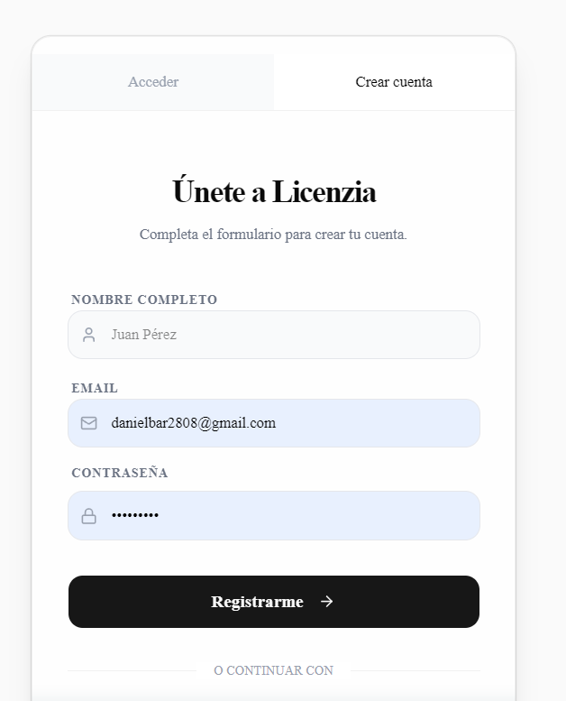
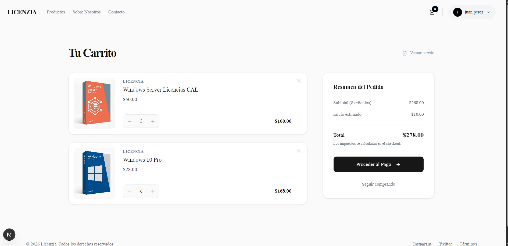
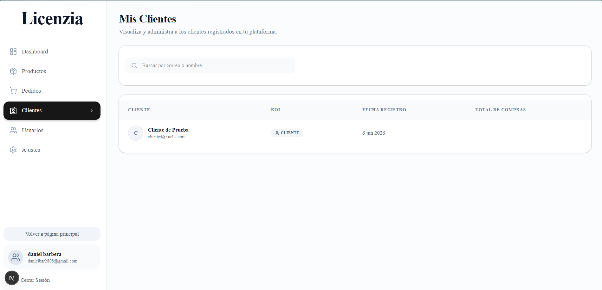
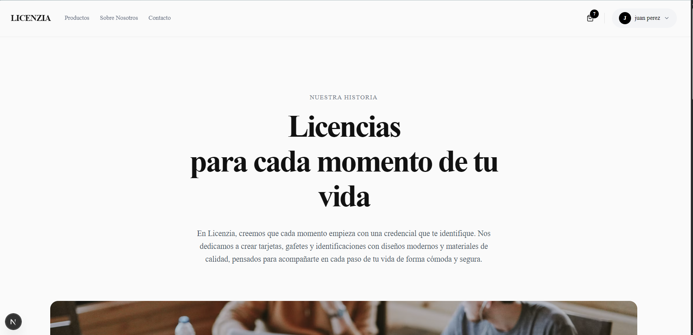
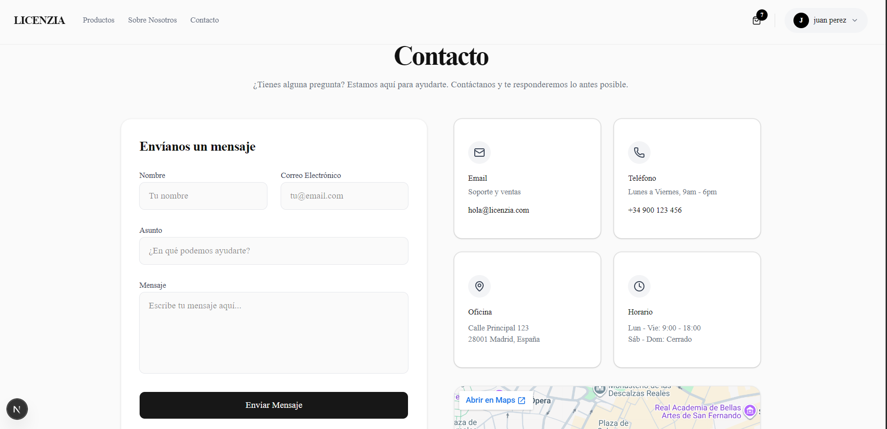
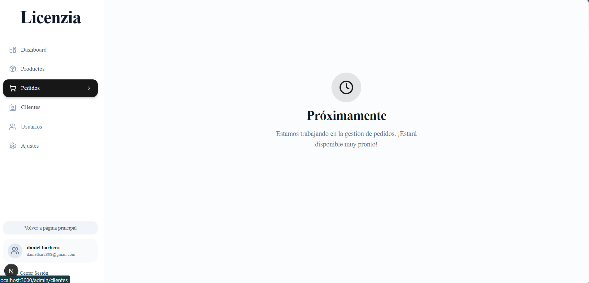

# Licenzia - Tienda Online

Este proyecto es una aplicación de comercio electrónico (tienda online) desarrollada con **Next.js**, **React**, **Tailwind CSS**, **Shadcn UI** y **Supabase** (para base de datos y autenticación).

## 🚀 Características y Funcionalidades

La tienda cuenta con diversas funcionalidades divididas por roles (Administrador y Usuario normal):

### 1. Autenticación y Seguridad
- **Login y Registro:** Sistema completo de registro e inicio de sesión para los clientes.
- **Roles de Usuario:**
  - **Admin:** Tiene control total sobre la plataforma, catálogo y roles.
  - **Usuario:** Puede explorar, agregar productos al carrito, simular compras y ver información básica.

### 2. Experiencia de Compra (Usuarios)
- **Página de Inicio y Catálogo:** Landing page y listado completo de productos (`/productos`).
- **Vista de Detalles:** Modal de producto interactivo para ver más información y agregar al carrito.
- **Carrito de Compras:** Interfaz para revisar los productos añadidos, cantidades y total.
- **Proceso de Checkout:** Selección de métodos de pago y una pasarela de pago (actualmente la transacción se encuentra **simulada**, pendiente de integrarse la lógica final a la base de datos).
- **Páginas Informativas:** Secciones dedicadas a "Nosotros" y "Contacto".

### 3. Panel de Administración (Admin)
- **Dashboard:** Panel principal de métricas y control de la tienda.
- **Gestión de Productos:** Interfaz para el listado, creación, edición y eliminación de productos del catálogo.
- **Subida de Imágenes:** Funcionalidad integrada para cargar y previsualizar imágenes de los productos desde el panel.
- **Gestión de Clientes y Roles:** Vista para administrar a todos los clientes registrados y poder asignar o revocar permisos de administración ("Gestión de roles de la tienda").

### 4. 🚧 Próximamente (En Desarrollo)
Dado que no formaban parte de los requisitos estrictos del curso, las siguientes áreas se encuentran marcadas con el aviso de **"Próximamente"**:
- **Mis Pedidos:** Historial de compras y seguimiento de órdenes para el usuario.
- **Ajustes / Configuración de la Cuenta:** Panel para modificar información personal, contraseña y preferencias del usuario.

---

## 🔑 Credenciales de Prueba

Para revisar el flujo del cliente, puedes utilizar el siguiente usuario de prueba:

- **Email:** `cliente@prueba.com`
- **Password:** `password123`

---

## 📸 Galería y Vistas de la Aplicación

A continuación, se presentan algunas capturas de la interfaz y funcionalidades de la tienda:

### Vistas Públicas y Catálogo
- **Inicio:**  
  
- **Productos:**  
  
- **Modal de Producto:**  
  

### Autenticación
- **Login:**  
  
- **Registro:**  
  

### Proceso de Compra
- **Carrito:**  
  
- **Método de Pago:**  
  
- **Pasarela de Pago (Simulada):**  
  

### Panel de Administración (Admin)
- **Dashboard de Administrador:**  
  
- **Gestión de Productos:**  
  
- **Editar Producto:**  
  
- **Subir Imagen de Producto:**  
  
- **Clientes:**  
  
- **Gestión de Roles:**  
  

### Páginas Informativas
- **Nosotros:**  
  
- **Contacto:**  
  

### Secciones "Próximamente"
- **Pantalla Próximamente:**  
  
- *(Ubicado en "Mis Pedidos" y "Configuración de la cuenta")*
  
  